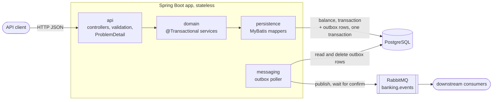
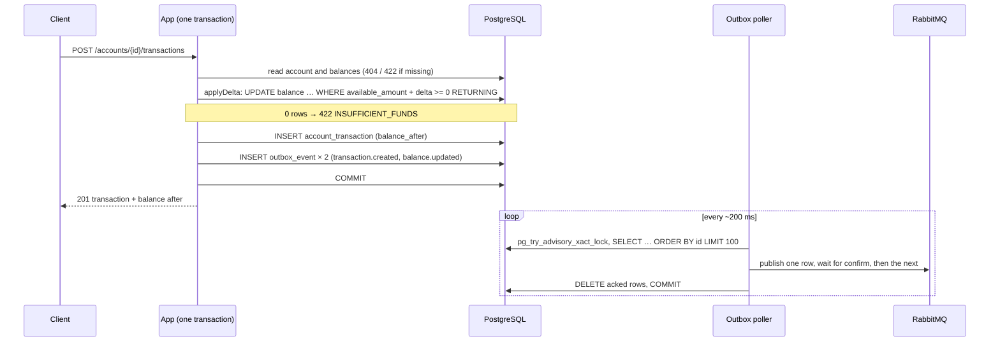

# Core banking account service

A small core-banking service built for the Tuum Software Engineer test assignment. It keeps customer
accounts, their per-currency balances (EUR, SEK, GBP, USD) and the transaction history behind a REST
API. Every insert and update is published to RabbitMQ. What and why: [`intent.md`](intent.md).
How: [`docs/design.md`](docs/design.md).



## Build and run

**Prerequisites:** Docker, with ports 5432, 5672, 15672 and 8080 free. Local development and the tests
also need JDK 25 (Gradle comes through the wrapper). `verify.sh` also needs `curl` and `jq` 1.7+.

```sh
docker compose up --build          # Postgres, RabbitMQ and the app; Flyway creates the schema on startup
```

- **API:** `http://localhost:8080`. Swagger UI: <http://localhost:8080/swagger-ui.html>.
- **RabbitMQ UI:** <http://localhost:15672> (`banking` / `banking`). Events show up in the
  `banking.events.all` demo queue.
- **Health:** <http://localhost:8080/actuator/health>.

```sh
./gradlew check                    # all tests on Testcontainers (real Postgres and RabbitMQ) + 80% coverage gate
.claude/skills/verify/verify.sh    # check, a clean compose stack on other ports, the contract check, teardown
```

Endpoints and errors: [design.md §2–3](docs/design.md#2-api). Event contract:
[§5](docs/design.md#5-event-contract). CI (`.github/workflows/ci.yml`) runs `verify.sh` on every PR and on `main`, plus a migration guard on PRs.

## Design choices

- **Money** ([ADR-0001](docs/adr/0001-money-handling.md)): `BigDecimal` at scale 2, stored as
  `NUMERIC(19,2)`. More than 2 decimals is rejected, never rounded.
- **Balance concurrency** ([ADR-0002](docs/adr/0002-balance-concurrency.md)): one conditional
  `UPDATE … WHERE available_amount + delta >= 0 RETURNING`. There is no read-check-write race, and a
  `CHECK` constraint backs it up.
- **Event delivery** ([ADR-0003](docs/adr/0003-event-delivery-outbox.md)): a transactional outbox, polled
  under an advisory lock. Delivery is at-least-once, and events stay in order per balance.
- **Event granularity** ([ADR-0004](docs/adr/0004-event-granularity.md)): one event per changed record,
  carrying the record's full state after the change.

Create transaction, end to end:



## Performance

Measured with k6 against the full compose stack on one laptop (Apple M5 Pro), with 50 VUs. Each figure is
the median of 3 runs of 60 s, with the load generator sharing the CPUs. Treat the numbers as a floor, not a
capacity plan. Details: [`docs/performance.md`](docs/performance.md). Reproduce with
`scripts/load-test.sh` (about 21 min).

| Scenario | Create transaction | p95 |
|---|---|---|
| Spread over 1,000 accounts | ≈ 7,400 TPS | 13 ms |
| One hot account (serialised by the balance row lock) | ≈ 2,300 TPS | 32 ms |

Event publishing is the bottleneck. Events keep up only below about **1,650 TPS** at best, and about
**575 TPS** under heavy load. Above that they arrive late, but none are lost.

## Horizontal scaling

- **The app is stateless.** All state is in Postgres, so instances can be added behind a load balancer
  ([design.md §1](docs/design.md#1-overview)).
- **Postgres coordinates the writers.** The conditional update and the balance row lock keep
  concurrent `OUT`s correct across instances
  ([ADR-0002](docs/adr/0002-balance-concurrency.md)).
- **One instance publishes at a time.** The advisory lock makes N instances safe, but it doesn't make
  publishing faster. To scale publishing, shard the outbox by balance, with one advisory lock per shard,
  or pipeline the confirms. Both keep per-balance order
  ([performance.md, Future work](docs/performance.md#future-work)).
- **Connections:** N instances × Hikari's pool of 10 must fit within Postgres `max_connections`. Postgres
  stays the single write limit. One hot account would need sharded sub-balances.
- **Consumers dedupe on `eventId`.** Delivery is at-least-once, and order holds only per balance
  ([design.md §5](docs/design.md#5-event-contract)).
- **A load-balancer retry of a POST can post twice.** Idempotency keys would fix that (below).

## How AI was used

The whole project was a practice run of an AI-native SDLC (plan → design → build → test → deploy →
maintain), using Claude Code. Stages 1–5 took about 8.4 active hours, and the project took 12 PRs in all. Full retro:
[`docs/retro.md`](docs/retro.md).

- **Docs first:** `intent.md`, `design.md` and the ADRs were agreed in chat, then committed, then used
  as the contract.
- **Project-specific agents:**
  - `test-writer` writes black-box tests from the spec only;
  - `banking-reviewer` checks code against the money, balance and event rules;
  - `spec-checker` checks the work against the PDF and the docs.

  `banking-reviewer` found an event-ordering bug that three general reviews had missed.
  `test-writer` found two real bugs, one of them a false claim an AI had written into ADR-0001.
- **Gates instead of reminders:**
  - hooks compile every Java edit, run `check` before each commit, and block edits to migrations;
  - CI re-runs everything and rejects a changed migration.

  Rules that had to be remembered became tests.
- **A human stayed in the loop:** every plan was approved before work started. After Claude committed
  too eagerly, showing review findings before each commit became a standing rule. The retro covers
  where Claude needed steering.

## Known limitations and future work

- **Health** (`/actuator/health`, app + DB) serves as both liveness and readiness. Behind an
  orchestrator they would be split. RabbitMQ is left out on purpose, so the app keeps serving through a
  broker outage.
- **Idempotency keys:** a retried POST can post twice today
  ([design.md §9](docs/design.md#9-revisit-as-the-system-grows)).
- **A version field in `balance.updated`:** a per-balance sequence, so a consumer can drop stale state
  without relying on delivery order ([design.md §9](docs/design.md#9-revisit-as-the-system-grows)).
- **Balance overflow** past `NUMERIC(19,2)` returns a 500, not a 422
  ([design.md §8](docs/design.md#8-known-limitations)).
- **Deviation from the PDF:** a zero amount is rejected (400 `INVALID_AMOUNT`). Other deviations:
  [design.md §7](docs/design.md#7-deviations-from-the-pdf).
